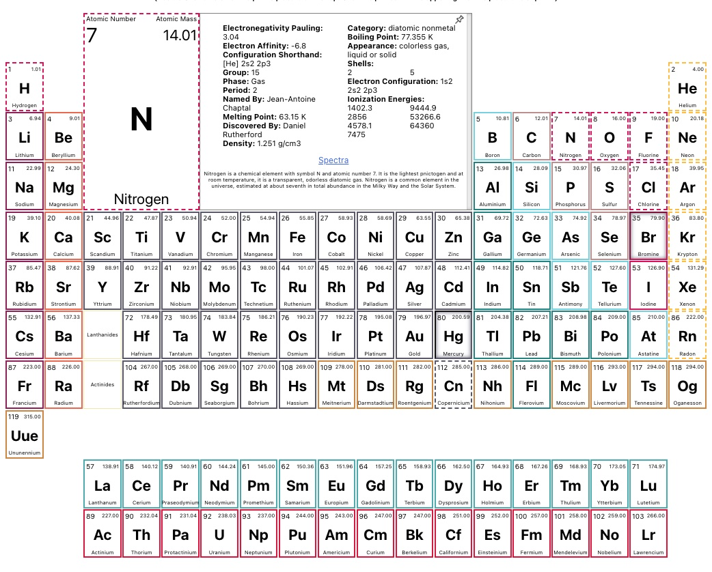

# Periodic Table App

Made with Vite.js ⚡, React ⚛️

This app visualizes the chemical elements in two ways:

* Classical tabular format with hover and click-to-pin interactions.
* Uses CSS Grid

* Radial diagram with polar coordinateswith hover and click interactions.
* Uses SVG groups, circles and paths.

[Demo](https://wjv.io/periodic-table)

